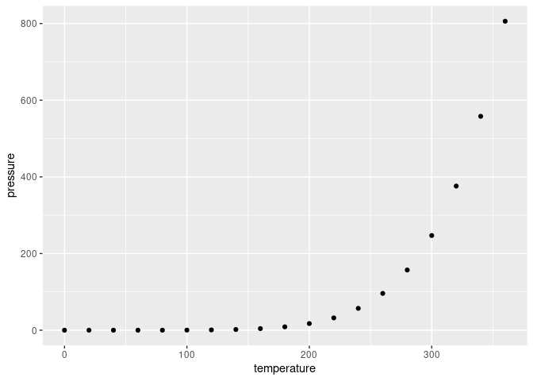

<!-- README.md is generated from README.Rmd. Please edit that file -->

# RMarkdown Reproducibility Example

<!-- badges: start -->
<!-- badges: end -->

This is a template RMarkdown document which follows minimal
reproducibility best practices.

## Dependencies

In this section, you should describe dependencies needed to execute your
code.

### System Dependencies

Make sure to list all system dependencies needed to execute your code.
For example, if you use R’s built-in pipe operator `|>`, then your code
depends on R version at least 4.1. If you use R’s stan package, then you
need V8 as a system dependency.

At the very least, you should provide a list of dependencies such as:

``` yaml
dependencies:
  - R>=4.1  # https://www.r-project.org/
  - V8  # https://v8.dev/
```

### R Package Dependencies

R packages dependencies can be managed and installed directly in your
code. For this, I recommend using the **pacman** package:

``` r
if (!require(pacman)) install.packages("pacman")
#> Loading required package: pacman

pacman::p_load(ggplot2)  # This installs and loads `ggplot`
```

## Code and Analyses

In this section, you should place all of your code and analyses.

### Managing Figures

If you generate figures for an external document, then make sure to both
display the figures and save them automatically to a subfolder. Note
that the subfolder may not exist on the computer of the person running
your code. As such, you should create if if it does not already exist:

``` r
fig <- ggplot(pressure) +
  geom_point(aes(x=temperature, y=pressure))

dir.create("output", showWarnings=FALSE)
ggsave("output/pressure_plot.pdf", fig)
#> Saving 7 x 5 in image

show(fig)
```

<!-- -->

## System Information

In this section, provide information about the system that was used to
execute the RMarkdown document. This information can be generated
automatically as follows:

``` r
sessionInfo()
#> R version 4.2.2 Patched (2022-11-10 r83330)
#> Platform: x86_64-pc-linux-gnu (64-bit)
#> Running under: Pop!_OS 22.04 LTS
#> 
#> Matrix products: default
#> BLAS:   /usr/lib/x86_64-linux-gnu/blas/libblas.so.3.10.0
#> LAPACK: /usr/lib/x86_64-linux-gnu/lapack/liblapack.so.3.10.0
#> 
#> locale:
#>  [1] LC_CTYPE=en_US.UTF-8       LC_NUMERIC=C              
#>  [3] LC_TIME=en_US.UTF-8        LC_COLLATE=en_US.UTF-8    
#>  [5] LC_MONETARY=en_US.UTF-8    LC_MESSAGES=en_US.UTF-8   
#>  [7] LC_PAPER=en_US.UTF-8       LC_NAME=C                 
#>  [9] LC_ADDRESS=C               LC_TELEPHONE=C            
#> [11] LC_MEASUREMENT=en_US.UTF-8 LC_IDENTIFICATION=C       
#> 
#> attached base packages:
#> [1] stats     graphics  grDevices utils     datasets  methods   base     
#> 
#> other attached packages:
#> [1] ggplot2_3.3.6 pacman_0.5.1 
#> 
#> loaded via a namespace (and not attached):
#>  [1] highr_0.9         pillar_1.8.1      compiler_4.2.2    tools_4.2.2      
#>  [5] digest_0.6.29     evaluate_0.16     lifecycle_1.0.1   tibble_3.1.8     
#>  [9] gtable_0.3.1      pkgconfig_2.0.3   rlang_1.0.5       cli_3.4.1        
#> [13] DBI_1.1.3         rstudioapi_0.14   yaml_2.3.5        xfun_0.32        
#> [17] fastmap_1.1.0     withr_2.5.0       stringr_1.4.1     dplyr_1.0.10     
#> [21] knitr_1.40        systemfonts_1.0.4 generics_0.1.3    vctrs_0.4.1      
#> [25] grid_4.2.2        tidyselect_1.1.2  glue_1.6.2        R6_2.5.1         
#> [29] textshaping_0.3.6 fansi_1.0.3       rmarkdown_2.16    farver_2.1.1     
#> [33] purrr_0.3.4       magrittr_2.0.3    scales_1.2.1      htmltools_0.5.3  
#> [37] assertthat_0.2.1  colorspace_2.0-3  labeling_0.4.2    ragg_1.2.2       
#> [41] utf8_1.2.2        stringi_1.7.8     munsell_0.5.0
```
